== 1. REACT
https://www.sololearn.com/learning/1097

=== FORT SMALL PROJECTS,we only need to add the React library as two script tags *to the head* of our HTML document

 

 

We also need to enable the use of JSX. (a syntax extension to JavaScript)

 

After adding the required script tags, we can start building our React app!

We add a container, that will be used to display something using React.

 

To put some code in it, you refer to the div (id= container in this case)

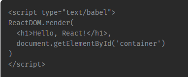

=== BIG PROJECTS
Real web apps have a different scale, contain multiple files, use 3rd party libraries, etc.

Facebook has created a handy tool called *Create React App* that makes it easy to setup a React project
with just a simple command!
To get started, make sure you have a recent version of Node installed on your machine.

Run the following commands in the Terminal to create and start a React app *called "my-app":*

 npx create-react-app my-app

 cd my-app

 npm start

This will install all the required dependencies, configure and start the project on localhost:3000.

=== 1.1. Project Structure
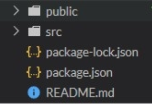

* The public folder contains files related to how the application will display on the client,
the most important of those being index.html, which is the HTML template of our page:

* The src folder contains all of the JavaScript, CSS, and image files that will be compiled into
a bundle file and injected into index.html

How is React compiled into a bundle file? It uses what is called a "file loader". In the case of Create React App,
Webpack is used.
Webpack creates a "bundle" file containing the content of multiple files that need to be "bundled" together
and it is all added together into a single file. Instead of making the HTML file go and find multiple files,
which can slow down load times tremendously, it only has to find one file.

NOTE:  all CSS and JS files need to be added to the src folder, otherwise webpack won't see them.

While there are other files in the src folder that come with Create React App when it is generated,
*the two files below are the only critical files*:

* *index.js:* This file is the entry point into our application. In the code above, a method called ReactDOM.render()
is used to find an element with id="root" in the HTML and add our React application inside of that element

* *App.js:* This file is the main component that will be rendered to the DOM, which currently includes the React logo
image and the default text, that we see in the output.

=== 1.2. JSX
JSX is a syntax extension to JavaScript. It allows us to build UI elements right in the JavaScript code!

React does not require using JSX, however, it is common practice in the React community to use JSX
as it eases the development of user interfaces, as well as allows React to show useful error and warning messages.

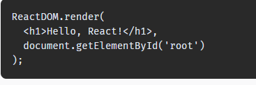

The code calls React's render method, and passes it two arguments, a JSX element and a container.
The render method displays the provided element in the container, which, in our case, is the HTML element with id="root".

NOTE: When you call the render method, any existing content of the container gets replaced.
That is why, usually, the containers are empty in the HTML.

==== 1.2.1. Expressions in JSX
We can use any JavaScript expression inside JSX using curly braces.

For example:

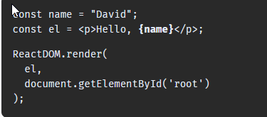

==== 1.2.2. Attributes in JSX

We can specify attributes using quotes, just like in HTML:

 

When using a JavaScript expression as the attributes value, the quotes should not be used:

 

NOTE: React DOM uses camelCase property naming convention instead of HTML attribute names.
For example, class becomes className in JSX.

==== 1.2.3. How Does JSX Work?

When the JSX expressions are compiled, they are converted into JavaScript objects, representing React elements.
React then uses these elements to build the corresponding HTML DOM and display it in the browser.

for example:

 let counter = 0;

 function show() {
  counter++;
  const el = 
{counter}
;
  ReactDOM.render(
    el, document.getElementById('root')
  );
}
setInterval(show, 1000);

We use setInterval to call the show function every second and render the counter element on the page.

NOTE: In practice, most React apps call ReactDOM.render() once.

=== 1.3. virtual DOM
React uses a Virtual DOM, which is a lightweight representation of the DOM
(DOM stands for Document Object Model and is a tree-like representation of the HTML page.).
When an element gets changed, it is first updated in the Virtual DOM. That process is fast,
as the virtual DOM is represented by simple objects.

After that, React compares the Virtual DOM to its previous state and only applies the DOM updates necessary
to bring the DOM to the desired state.

=== 1.4. Components
Components let you split the page into independent and reusable parts, they allow us (as the developers)
to separate concerns from one another.

In React, there are two types of components that you can use: Functional Components and Class Components.

 1. *Class Components* : Class components are typically used when there are more advanced user interactions,
like forms, and animations.

*All class components need to extend the React.Component class. They need to have a render method,
which is in charge of telling what the page should show.*

 class Hello extends React.Component {
 render() {
    return <h1>Hello world.</h1>;
  }
}

[start=2]
. *Functional Components* : A functional component is a simple JavaScript function:

 function Hello() {
  return <h1>Hello world.</h1>;
}

NOTE: The name of the functional component begins with a capital letter. This is absolutely critical.
If we start the name of a component with a lowercase letter, the browser will treat our component like
a regular HTML element instead of a Component.

In order to display the component, we need to create the corresponding JSX element.

 function Hello() {
  return <h1>Hello world.</h1>;
}

 const el = <Hello />;

 ReactDOM.render(
  el,
  document.getElementById('root')
 );

==== 1.4.1. Components using Components
Components can use other components to generate an output.

For example:

 function Hello(props) {
 return 
Hello, {props.name}!
;
 }

 function App() {
  return 

    <Hello name="David" />
    <Hello name="James" />
    <Hello name="Amy" />
  
;
 }

 const el = <App />;
 ReactDOM.render(
  el,
  document.getElementById('root')
 );

Here, our App component uses the Hello component three times, each times with a new name attribute.

NOTE: Generally, it is a good practice to split complex components into multiple smaller components, that are reusable.
For example, a Post component can use an Avatar component, an Image component, a Date component, etc.

==== 1.4.2.Props

. Props in functional components:

Functional Components can accept arguments, similar to JavaScript functions.
These arguments are called props, and represent an object.

For example, we can use props in our Hello component:

 function Hello(props) {
  return 
Hello, {props.name}!
;
}

Now, we can add a name attribute to our element:

 const el = <Hello name="David" />;

The attribute value will be passed to the component when rendered.

[start=2]
. Props in Class Components

Props can be accessed in class components using this.props.

For example:

 class Hello extends React.Component {
  render() {
    return 
Hello, {this.props.name}!
;
  }
 }

*!!! props are read-only, meaning components cannot modify their props.*

==== 1.4.3. state

Many web apps need their components to change their data, for example, after user interaction
(clicking a button, submitting a form, etc.).
However, props cannot be changed.

In order to allow components to manage and change their data, React provides a feature called state.
*State is an object that is added as a property in class components.*

For example:

 class Hello extends React.Component {
 state = {
 name: "James"
 }
 render() {
 return <h1>Hello {this.state.name}.</h1>;
 }
 }

 const el = <Hello />;
 ReactDOM.render(
 el,
 document.getElementById('root')
 );

state is just a simple object, that contains key:value pairs.
Similar to props, the values can be accessed using this.state.

NOTE: The state object can contain multiple key:value pairs, separated by commas.

===== 1.4.3.1. Changing State
State should not be modified directly. Instead, React provides a setState() method, that can be used to modify state.

 this.setState({
   name: "James",
   age: 25
 });

When setState is called, React automatically re-renders the affected component with the new state!

Usually, the change in state happens in event handlers

example:

 class Counter extends React.Component {
 state = {
 counter: 0
 }
 increment = () => {
 this.setState({counter: this.state.counter+1});
 }
 render() {
 return 

 
{this.state.counter}

 <button onClick={this.increment}>Increment</button>
 
;
 }
 }

 const el = <Counter />;
 ReactDOM.render(
 el,
 document.getElementById('root')

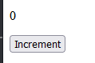
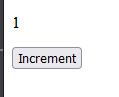
...

==== 1.4.4. Props vs State

- We use props to pass data to components.
- Components use state to manage their data.
- Props are read-only and cannot be modified.
- State can be modified by its component using the setState() method.
- The setState() method results in re-rendering the component affected.

=== 1.5 Hooks
Hooks allows us to use state inside of functional components.

First, we need to import the useState hook:

 import React, { useState } from 'react';

useState returns a pair, the current state value and a function, that lets you change the state.

useState takes one argument, which is the initial value of the state.

example 1:

 function Hello() {
 const [name, setName] = useState("David");

  return <h1>Hello {name}.</h1>;
 }

 const el = <Hello />;
 ReactDOM.render(
 el,
 document.getElementById('root')

example 2:

 function Counter() {
 const [counter, setCounter] = useState(0);

  function increment() {
    setCounter(counter+1);
  }
  return 

  
{counter}

  <button onClick={increment}>Increment</button>
  
;
 }

 const el = <Counter />;
 ReactDOM.render(
 el,
 document.getElementById('root')
 );

BEFORE HOOKS, the function looks like this;

 class Counter extends React.Component {
 state = {
 counter: 0
 }
 increment = () => {
 this.setState({counter: this.state.counter+1});
 }
 render() {
 return 

 
{this.state.counter}

 <button onClick={this.increment}>Increment</button>
 
;
 }
 }
 const el = <Counter />;
 ReactDOM.render(
 el,
 document.getElementById('root')

=== 1.6. Lifecycle Methods

React provides special *lifecycle methods for class components*, which are called when components are mounted,
updated or unmounted.

* Mounting is the process when a component is rendered on the page.
* Unmounting is the process when a component is removed from the page.

==== 1.6.1 The *componentDidMount method* (only in Class Components)
Is called when a component is rendered on the page.

For example, we can use componentDidMount in our Counter app to set the initial value of the counter:

 class Counter extends React.Component {
 state = {
 counter: 0
 }
 increment = () => {
 this.setState({counter: this.state.counter+1});
 }
 componentDidMount() {
 this.setState({counter: 42});
 }
 render() {
 return 

 
{this.state.counter}

 <button onClick={this.increment}>Increment</button>
 
;
 }
 }

 const el = <Counter />;
 ReactDOM.render(
 el,
 document.getElementById('root')
 );

componentDidMount is typically used for populating the state inside of a component when it initially mounts to the DOM.

==== 1.6.2. The *componentWillUnmount method* (only in Class Components)
I similarly to the componentDidMount method, but the componentWillUnmount() lifecycle method is called right before
the component is removed from the DOM.
It can be used to free up resources taken by the component.

==== 1.6.3. The *componentDidUpdate method* (only in Class Components)
Is called when a component is updated in the DOM.

We can, for example, alert the current counter value when it is incremented:

 class Counter extends React.Component {
  state = {
    counter: 0
  }
  increment = () => {
    this.setState({counter: this.state.counter+1});
  }
  componentDidUpdate() {
    alert("Number of clicks: " + this.state.counter);           // shows an alertbox
  }
  render() {
    return 

    
{this.state.counter}

    <button onClick={this.increment}>Increment</button>
    
;
  }
 }

 const el = <Counter />;
 ReactDOM.render(
 el,
 document.getElementById('root')
 );

==== 1.6.4. The *useEffect Hook* (only in Function Components)
React provides a special Hook called useEffect to make lifecycle methods available in functional components.
It combines the componentDidMount, componentDidUpdate, and componentWillUnmount methods into one.

 function Counter() {
 const [counter, setCounter] = useState(0);

  useEffect(() => {
    alert("Number of clicks: " + counter);
  });

  function increment() {
    setCounter(counter+1);
  }
  return 

  
{counter}

  <button onClick={increment}>Increment</button>
  
;
 }

 const el = <Counter />;
 ReactDOM.render(
 el,
 document.getElementById('root')
 );

When you run the code, you'll notice that the alert dialog appears also during the first render. This is caused by the fact that, by default, useEffect runs both, after the first render and after every update.

To call the method only when something changes, we can provide it a second argument:

 useEffect(() => {
  //do something
 }, [count]);

Now, the useEffect() method will run only if count changes.

To mimic componentWillUnmount, useEffect may return a function that cleans up after it:

 useEffect(() => {
   // do something
  return () => {
    // cleanup
  };
 });

NOTE: Just like with the useState hook, we need to import useEffect to be able to use it:
import React, { useState, useEffect } from 'react';

=== 1.7. Event Handling
Handling events in React is very similar to handling events in the DOM.

The only difference is that event names use camelCase syntax and the event handler needs to be passed in curly braces.

For example, to handle the click event on a button:

 <button onClick={handleClick}>My Button</button>

Clicking the button will call the handleClick function of the component.

 function Counter() {
  const [counter, setCounter] = useState(0);

  function increment() {
    setCounter(counter+1);
  }
  return 

  
{counter}

  <button onClick={increment}>Increment</button>
  
;
 }

 const el = <Counter />;

 ReactDOM.render(
 el,
 document.getElementById('root')
 );

OR IN A CLASS COMPONENT:

 class Counter extends React.Component {
 state = {
 counter: 0
 }

 increment = () => {
 this.setState({counter: this.state.counter+1});
 }

 render() {
 return 

 
{this.state.counter}

 <button onClick={this.increment}>Increment</button>
 
;
 }
 }

 const el = <Counter />;

 ReactDOM.render(
 el,
 document.getElementById('root')
 );

=== 1.8. Handling User Input

One of the common ways that users interact with web pages is through text fields.

We can ** handle user input** in React using the *onChange event* of the text field.
When the value of the text field changes, the event handler is called, updating the value of the field
in the component's state. This way you always have the actual value of the text field in the state.

example:

 function Converter() {
 const [km, setKm] = useState(0);

  function handleChange(e) {
    setKm(e.target.value);
  }

  function convert(km) {
    return (km/1.609).toFixed(2);
  }

  return 

  <input type="text" value={km} onChange={handleChange} />
  
 {km} km is {convert(km)} miles 

  
;
}

 const el = <Converter />;

 ReactDOM.render(
 el,
 document.getElementById('root')
);

Our Converter component includes a text field, which calls the handleChange function when its value changes.
The handleChange function updates the state with the current value of the textfield, causing the component to re-render and show the corresponding miles value, which is calculated using the convert function.

NOTE: The value of the text field is accessed via the e object, which represents the React event.
It is passed to the event handler function as an argument and can be used to access the event object.

=== 1.9. Forms
Text fields are usually part of a form. React form elements keep their state and update it based on user input.
This way you always have the data of your form at your disposal in the state.

Example: a form that will add numbers every time the form is submitted and display the sum.
The form contains an input field and a submit button:

 function AddForm() {
   const [sum, setSum] = useState(0);
   const [num, setNum] = useState(0);

  function handleChange(e) {
     setNum(e.target.value);
  }

  function handleSubmit(e) {
     setSum(sum + Number(num));
     e.preventDefault();          // !!! see NOTE !!!
  }

   return <form onSubmit={handleSubmit}>
   <input type="number" value={num} onChange={handleChange} />
   <input type="submit" value="Add" />
   
 Sum is {sum} 

   </form>;
 }

 const el = <AddForm />;

 ReactDOM.render(
 el,
 document.getElementById('root')
 );

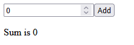

NOTE: The e.preventDefault(); statement prevents the default behavior of the form, which, by default, reloads the page when submitted. In JavaScript we would use return false; for that, but in React we need to call preventDefault().

=== 1.10. Lists

Web apps commonly contain repeating elements, such as lists or sections, where the same DOM element is repeated
with a different data set.

 function MyList(props) {
 const arr = props.data;
 const listItems = arr.map((val) =>       //NOTE 1
 <li>{val}</li>
 );
 return <ul>{listItems}</ul>;
 }

 const arr = ["A", "B", "C"];              //array of strings
 const el = <MyList data={arr} />;         //NOTE 2

 ReactDOM.render(
 el,
 document.getElementById('root')
 );

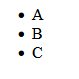

NOTE 1 : In React, the map method is used to traverse and display a list of similar objects of a component.
A map is not a feature of React. Instead, it is the standard JavaScript function that could be called on an array.
The map() method creates a new array by calling a provided function on every element in the calling array

NOTE 2:  We need to render a list <li> element for each item in the array.
**We can define a MyList component and pass it the array as a prop using a custom data attribute**

=== 1.11. Keys

Each element in a list must have a key attribute.
Keys act as a unique identity, identifying each element.
Usually, these are IDs from your data, or can be auto-generated indexes.

 function MyList(props) {
 const arr = props.data;
 const listItems = arr.map((val, index) =>
 <li key={index}>{val}</li>
 );
 return <ul>{listItems}</ul>;
 }

 const arr = ["A", "B", "C"];
 const el = <MyList data={arr} />;

 ReactDOM.render(
 el,
 document.getElementById('root')
 );

=== 1.12. Sharing State

Sometimes we need to share the state between the components.
We can do that by lifting the state up to a parent component.
This means that the parent component will hold the data that needs to be shared between the components.

NOTE: Data can be passed from the parent to the child, but not from the child to the parent.
React uses what is called unidirectional data flow, in other words, data only flows downward, so to speak.

NOTE: props can be used to pass down not only state, but also functions, that may manipulate the state.
This way, we are able to store the application state in the parent and allow its child components to use
and manipulate the state.

== 2. REDUX
Redux was created to make state management predictable, providing a single state container and strict rules
on how state can be changed.

Redux is a small JavaScript library and can be used with any front-end framework, such as React, Angular, jQuery.

It employs the "single source of truth" pattern.
In short, single source of truth just refers to relocating the application state and all associated logic o
utside of the application, allowing ANY component to access the data it needs.

NOTE: Having a single state container makes it easier to manage the state of your application, as you can access and change the data from any component that needs it, without having to pass down the data.

== NODE.JS

Node.js is an open source cross-platform runtime environment written in JavaScript.
It is built on Chrome’s V8 JavaScript engine, which parses and executes the JavaScript code.
Node uses an event-driven, non-blocking I/O model, which makes it fast and lightweight.

Node is *best suited* for building *software and applications* that *require real-time,
synchronous interactions* such as chat apps and websites.
Yet it also has other uses and benefits which make it popular among developers, as well, all contributing to its popularity.

===  Why It Is Called Node

It’s called Node because it is used to build simple single-process blocks called nodes.
These nodes can be organized with good networking protocols for communication with each other
and be scaled up to build large distributed programs.

=== 3. Non-blocking in Node

This is the main feature of Node. You need to understand how inout/output (I/O) operations
(This includes HTTP requests, database operations and disk reads and writes) in Node are performed asynchronously,
with the lines of code adhering to a non blocking pattern.
The single thread of execution asks the runtime to perform an operation, providing a callback function
and then moves on to do something else. When the operation has been completed, a message is enqueued
along with the provided callback function.
At some point in the future, the message is dequeued and the callback fired.

* Give Node instructions (a function) to execute.
    * Give the function some arguments.
    * Give Node a callback with your function.
    * Node will proceed to take instructions from other lines after yours.
    * When your function has been computed, Node will call your callback with the result of the computation.

=== 4.Concept of the Event Loop
https://blog.carbonfive.com/the-javascript-event-loop-explained/

Basically, there is a stack, a heap, and a queue. In a loop, the queue is polled for the next message
and when a message is encountered, the callback for that message is executed.
The decoupling of the caller from the response allows for the JavaScript runtime to do other things
while waiting for your asynchronous operation to complete and their callbacks to fire.
But where in memory do these callbacks live – and in what order are they executed?
What causes them to be called? JavaScript runtimes contain a message queue which stores a list of messages to be processed
and their associated callback functions. These messages are queued in response to external events
(such as a mouse being clicked or receiving the response to an HTTP request) given a callback function has been provided.
If, for example a user were to click a button and no callback function was provided –
no message would have been enqueued. In a loop, the queue is polled for the next message
(each poll referred to as a “tick”) and when a message is encountered, the callback for that message is executed.

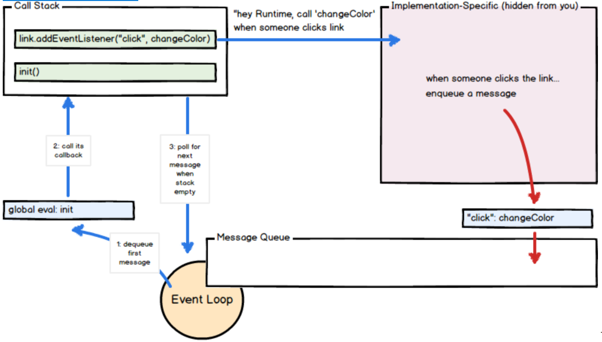

The calling of this callback function serves as the initial frame in the call stack, and due to JavaScript being single-threaded,
further message polling and processing is halted pending the return of all calls on the stack.
Subsequent (synchronous) function calls add new call frames to the stack
(for example, function init calls function changeColor).

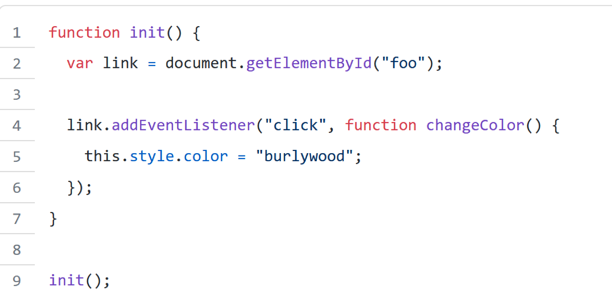

== EXPRESS JS

https://www.simplilearn.com/tutorials/nodejs-tutorial/what-is-express-js
https://levelup.gitconnected.com/better-logs-for-expressjs-using-winston-and-morgan-with-typescript-1c31c1ab9342

*Node JS is* a fast JavaScript *runtime* environment that we use *to build server-side applications*,
but it does not know how to perform serving files, handling requests, and handling HTTP methods,
so this is where express js comes in.

*Express JS is a Node.js framework* designed to build API's web applications cross-platform mobile apps quickly
and make node js easy

=== What Is Express JS In Node JS?

Express is a node js web application framework that provides broad features for building web and mobile applications.
It is used to build a single page, multipage, and hybrid web application.

It's a layer built on the top of the Node js that helps manage servers and routes.

=== Why Express JS?

* Express was created to make APIs and web applications with ease,
    * It saves a lot of coding time almost by half
    * makes web and mobile applications are efficient.
    * It is written in javascript

The reason behind creating an express framework for node js is:

* Time-efficient
    * Fast
    * Economical
    * Easy to learn
    * Asynchronous

Also Read: Node.js for Beginners: How to Get Started
https://www.simplilearn.com/nodejs-for-beginners-article

=== Features of Express JS

* Fast Server-Side Development: The features of node js help express saving a lot of time.

    * Middleware: is a request handler that has access to the application's request-response cycle.

    * Routing: It refers to how an application's endpoint's URLs respond to client requests.

    * Templating: It provides templating engines to build dynamic content on the web pages by creating HTML templates on the server.

    * Debugging: Express makes it easier as it identifies the exact part where bugs are.

=== Advantages of Using Express With Node.js

* Express is Unopinionated, and we can customize it.
    * For request handling, we can use Middleware.
    * A single language is used for frontend and backend development.
    * Express is fast to link it with databases like MySQL, MongoDB, etc.
    * Express allows dynamic rendering of HTML Pages based on passing arguments to templates.

=== Limitations of Express JS

* Sometimes, there is no structural way to organize things, and the code becomes non-understandable.
    * There are so many issues with callbacks.
    * The error messages that will come are challenging to understand.

=== Installation and the First Program

To install Express JS on your system first you need to install node js
then we will write a command to install express in the terminal.

    npm install express

The express js will be installed in your system.

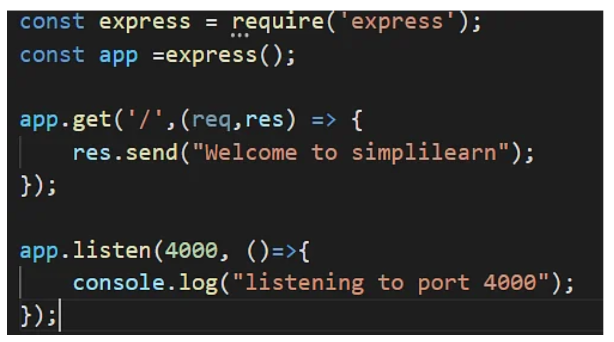
(we print “Welcome To Simplilearn” on the server.)

== CORS
https://stackabuse.com/handling-cors-with-node-js/

=== What is CORS
CORS is shorthand for *Cross-Origin Resource Sharing*.
It is a mechanism to allow or restrict requested resources on a web server depend on where the HTTP request was initiated.

This policy is used to secure a certain web server from access by other website or domain.
For example, only the allowed domains will be able to access hosted files in a server such as a stylesheet, image, or a script.

If you are currently on http://example.com/page1 and you are referring an image from http://image.com/myimage.jpg
you won't be able to fetch that image unless http://image.com allows cross-origin sharing with http://example.com.

There is an HTTP header called origin in each HTTP request. It defines from where the domain request has originated.
We can use header information to restrict or allow resources from our web server to protect them.

NOTE: By default requests from any other origins will be restricted by the browser.

For example, while you are still in the development stage - if you are using a frontend library such as React,
your front end application will be served on http://localhost:3000.
Meanwhile, your Express server might be running on a different port such as http://localhost:2020.

Because of this, you'll need to allow CORS between those servers.
If you see this common error in your browser console. CORS restrictions could be the issue:

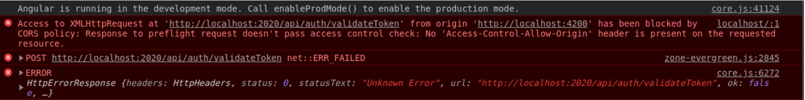

CORS is really useful when you're offering a public API and would like to control the access to certain resources
and how people use them.

Also, if you want to use your own API or files on a different web page you can simply configure CORS to allow that,
while still blocking others out.

==== HOW TO?:
1. configure CORS with Express

Start off with a fresh project.
install the required modules. We'll be using express and the cors middleware:

Then create an express web application with two routes

Make a file, called index.js that acts as a web server, with a couple of request handlers, so you can run the app and the server:

[start=2]
2. Enable All CORS Requests

If you want to enable CORS for all the request you can simply use the cors middleware before configuring your routes:

 const express = require('express');
 const cors = require('cors');

 const app = express();

 app.use(cors())

 ......

This will allow all the routes to be accessed anywhere on the web if that is what you need.
For example, if our server is running on http://www.example.com and serves content such as images - we allow other domains,
such as http://www.differentdomain.com to refer the content from http://www.example.com.

[start=3]
3. Enable CORS for a Single Route

But if you need a certain route to be accessible and not other routes, you can configure cors in a certain route as a
middleware instead of configuring it to the whole app:

This will allow a certain route to be accessible by any domain.
For example, if you try to send a fetch request to the / path from a different origin -
it will be successful.

But if you try to access any other path other than the root path this request will be blocked by the browser:

[start=4]
4. Configure CORS with Options

You can also use the configuration options with CORS to customize this further.
You can use configuration to allow a single domain or subdomains access, configure HTTP methods that are allowed
such as GET and POST depending on your requirements.
If you configure the domain name in the origin - the server will allow CORS from the configured domain.

You can also configure allowed HTTP methods if you'd like:

for example: A POST request will be blocked by the browser if only GET and PUT are supported:

[start=5]
5. Configuring Dynamic CORS Origins using a Function

If configurations do not satisfy your requirements, you can create your function to customize CORS.

[start=6]
6. Loading List of Allowed Origins from as Data Source

You can use also use a list of allowed domains from a database or using any backing data source to allow CORS:

== HEADERS
https://www.educative.io/answers/how-to-set-headers-in-request-in-nodejs

A header node is a special node that is found at the beginning of the list.
A list that contains this type of node, is called the header-linked list.
This type of list is useful when information other than that found in each node is needed.
For example, suppose there is an application in which the number of items in a list is often calculated.
Usually, a list is always traversed to find the length of the list.
However, if the current length is maintained in an additional header node that information can be easily obtained.

We will use request.setHeader() to set header of our request. The header tells the server details
about the request such as what type of data the client, user, or request wants in the response.

https://www.codegrepper.com/code-examples/javascript/add+access-control-allow-origin+header+node+js

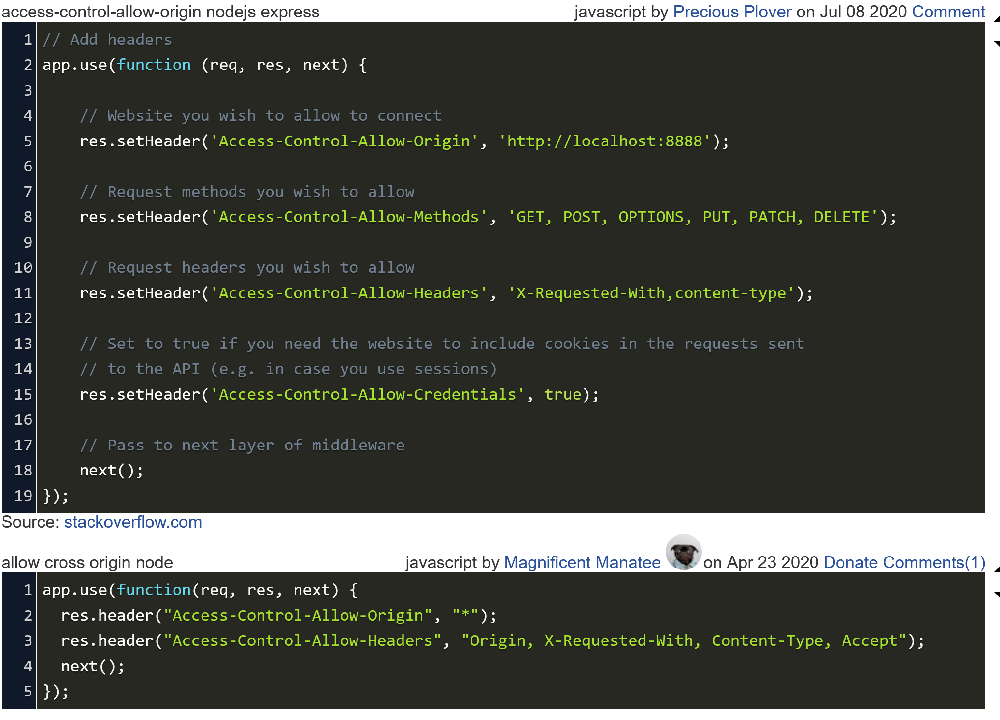

=== Access HTTP headers values from a request
https://flaviocopes.com/express-headers/

You can access all the HTTP headers using the Request.headers property:

 app.get('/', (req, res) => {
 console.log(req.headers)
 })

Use the Request.header() method to access one individual request header’s value:

 app.get('/', (req, res) => {
 req.header('User-Agent')
 })

=== Change any HTTP header value for a response

You can change any HTTP header value using Response.set():

 res.set('Content-Type', 'text/html')

There is a shortcut for the Content-Type header, however:

 res.type('.html')
 // => 'text/html'

 res.type('html')
 // => 'text/html'

 res.type('json')
 // => 'application/json'

 res.type('application/json')
 // => 'application/json'

 res.type('png')
 // => image/png:

{sp}

== RESTful web API design

Most modern web applications expose APIs that clients can use to interact with the application.
A well-designed web API should aim to support:

    * *Platform independence*.
    Any client should be able to call the API, regardless of how the API is implemented internally.
    This requires using standard protocols, and having a mechanism whereby the client and the web service can agree
    on the format of the data to exchange.

    * *Service evolution*.
    The web API should be able to evolve and add functionality independently from client applications.
    As the API evolves, existing client applications should continue to function without modification.
    All functionality should be discoverable so that client applications can fully use it.

=== What is REST?
https://docs.microsoft.com/en-us/azure/architecture/best-practices/api-design

In 2000, Roy Fielding proposed Representational State Transfer (REST) as an architectural approach to designing web services.
REST is an architectural style for building distributed systems based on hypermedia.
REST is independent of any underlying protocol and is not necessarily tied to HTTP.
However, most common REST API implementations use HTTP as the application protocol.

A primary advantage of REST over HTTP is that it uses open standards, and does not bind
the implementation of the API or the client applications to any specific implementation.
For example, a REST web service could be written in ASP.NET, and client applications can use any language
or toolset that can generate HTTP requests and parse HTTP responses.

=== design principles of RESTful APIs using HTTP:

 * REST APIs are designed around resources, which are any kind of object, data, or service that can be accessed by the client.

 * *A resource has an identifier, which is a URI* that uniquely identifies that resource.

For example, the URI for a particular customer order might be:

 https://adventure-works.com/orders/1

 * Clients interact with a service by exchanging representations of resources.
   Many web APIs use JSON as the exchange format.
   For example, a GET request to the URI listed above might return this response body:

 {"orderId":1,"orderValue":99.90,"productId":1,"quantity":1}

 * REST APIs use a uniform interface, which helps to decouple the client and service implementations.
For REST APIs built on HTTP, the uniform interface includes using standard HTTP verbs to perform operations on resources.
The most common operations are GET, POST, PUT, PATCH, and DELETE.

 * REST APIs use a stateless request model. HTTP requests should be independent and may occur in any order,
so keeping transient state information between requests is not feasible.
The only place where information is stored is in the resources themselves, and each request should be an atomic operation.
This constraint enables web services to be highly scalable, because there is no need to retain any affinity between
clients and specific servers. Any server can handle any request from any client.
That said, other factors can limit scalability. For example, many web services write to a backend data store,
which may be hard to scale out.

 * REST APIs are driven by hypermedia links that are contained in the representation.
For example, the following shows a JSON representation of an order.
It contains links to get or update the customer associated with the order.

 {
 "orderID":3,
 "productID":2,
 "quantity":4,
 "orderValue":16.60,
 "links": [
 {"rel":"product","href":"https://adventure-works.com/customers/3", "action":"GET" },
 {"rel":"product","href":"https://adventure-works.com/customers/3", "action":"PUT" }
 ]
 }

* In 2008, Leonard Richardson proposed the following maturity model for web APIs:

** Level 0: Define one URI, and all operations are POST requests to this URI.
** Level 1: Create separate URIs for individual resources.
** Level 2: Use HTTP methods to define operations on resources.
** Level 3: Use hypermedia (HATEOAS, described below).

Level 3 corresponds to a truly RESTful API according to Fielding's definition.
In practice, many published web APIs fall somewhere around level 2.

* Organize the API design around resources

Focus on the business entities that the web API exposes.
For example, in an e-commerce system, the primary entities might be customers and orders.
Creating an order can be achieved by sending an HTTP POST request that contains the order information.
The HTTP response indicates whether the order was placed successfully or not.
When possible, resource URIs should be based on nouns (the resource) and not verbs
(the operations on the resource).

 https://adventure-works.com/orders // Good

 https://adventure-works.com/create-order // Avoid

* A resource doesn't have to be based on a single physical data item. void creating APIs that simply mirror
the internal structure of a database. The purpose of REST is to model entities and the operations
that an application can perform on those entities. A client should not be exposed to the internal implementation.

*use plural nouns for URIs that reference collections.*

*organize URIs for collections and items into a hierarchy*.

For example, /customers is the path to the customers collection, and /customers/5 is the path to the customer with ID equal to 5.
This approach helps to keep the web API intuitive.
Also, many web API frameworks can route requests based on parameterized URI paths,
so you could define a route for the path /customers/{id}.

* Also *consider the relationships between different types of resources* and how you might expose these associations.
Provide navigable links to associated resources in the body of the HTTP response message.

* Another factor is that *all web requests impose a load on the web server*. The more requests, the bigger the load.
Therefore, try to *avoid "chatty" web APIs that expose a large number of small resources.*

* Avoid introducing dependencies between the web API and the underlying data sources

=== Define API operations in terms of HTTP methods
The HTTP protocol defines a number of methods that assign semantic meaning to a request.
The common HTTP methods used by most RESTful web APIs are:

 * GET retrieves a representation of the resource at the specified URI.
The body of the response message contains the details of the requested resource.
 * POST : a post request *creates a resource*. The server assigns a URI for the new resource, and returns that URI to the client.
In the REST model, you frequently apply POST requests to collections.
The new resource is added to the collection. A POST request can also be used to submit data for processing
to an existing resource, without any new resource being created.
Note that POST can also be used to trigger operations that don't actually create resources.
 * PUT: A PUT request *creates a resource or updates an existing resource*.
The client specifies the URI for the resource. The request body contains a complete representation of the resource.
If a resource with this URI already exists, it is replaced. Otherwise a new resource is created, if the server supports doing so.
PUT requests are most frequently applied to resources that are individual items, such as a specific customer,
rather than collections. A server might support updates but not creation via PUT.
Whether to support creation via PUT depends on whether the client can meaningfully assign a URI to a resource before it exists.
If not, then use POST to create resources and PUT or PATCH to update.
The body of the request message specifies the resource to be created or updated.
 * PATCH:  a patch request *performs a partial update to an existing resource*.
The client specifies the URI for the resource. The request body specifies a set of changes to apply to the resource.
This can be more efficient than using PUT, because *the client only sends the changes, not the entire representation of the resource*.
Technically PATCH can also create a new resource (by specifying a set of updates to a "null" resource), if the server supports this.
 * DELETE removes the resource at the specified URI.

== PROJECT STRUCTURE (server)

What would be a good project structure for a Node.js application?

https://bytearcher.com/articles/node-project-structure/

Small applications don't matter that much, but for larger apps with more complex logic, it's worth thinking
about the project structure.

One way to organize a project is to use three-layer architecture.

=== Three-layer architecture

The project is structured into three layers: API, Service and Integration layers.

Each layer has a specific set of responsibilities that are clearly defined and easy to grasp.
Each layer accesses the layer below it, never above it.
Serving a request touches each layer starting from the top, traveling all the way down,
and then resurfacing back to the topmost layer.

=== API layer

The API Layer is responsible for receiving the HTTP request and parsing the payload from it.
This layer would then forward the payload removed of any HTTP-specific items to the following Service layer.

Express.js lives only on this level. You'd have your main app.js that set up the server and individual route files.
Route files define validations and call service layers, leaving all req and res objects behind.

=== Service layer

The Service Layer is responsible for performing business logic, i.e. making things happen.
It's agnostic of any HTTP specific constructs, and the caller could as well as be a command-line application,
a timer job or a test suite. Input is plain vanilla JavaScript objects instead of JSON.

Services perform business logic. They validate inputs against business rules and call other services in the Service layer.
If they need to talk to outside systems, they use the Integration layer to do that.

=== Integration layer

The code in the Integration Layer is responsible for performing I/O outside the process boundaries.
It talks to databases and makes HTTP requests to 3rd party web APIs.

Most of the contents in this layer would be higher abstraction clients.
For example, a client handling the communication to a web API would accept vanilla objects as arguments
and would hide the complexity of formulating an HTTP request payload and making the call.

=== Clear responsibilities

This division achieves separation of concerns. Each layer has a specific responsibility,
and it translates well into a directory structure.

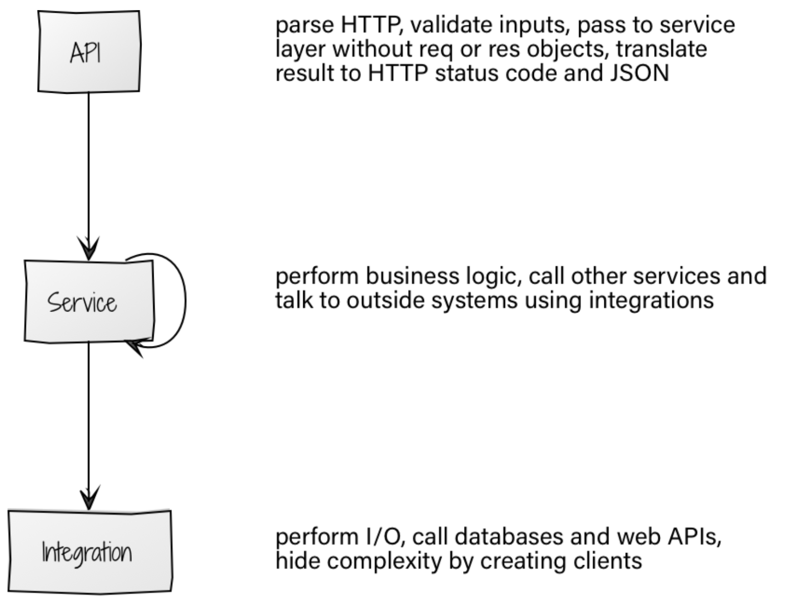

You could translate this architecture into a project structure by having a separate directory for each layer.

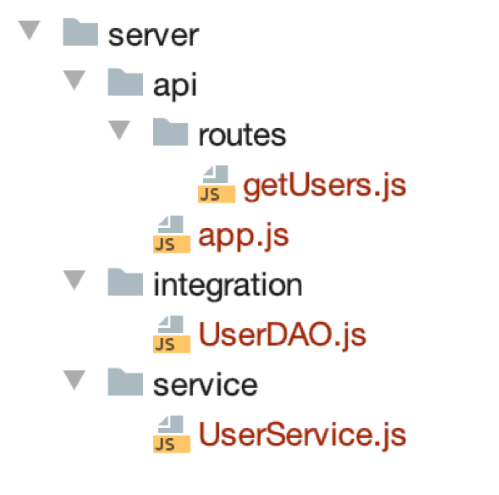
