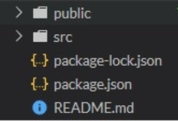
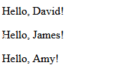

== 1. REACT
https://www.sololearn.com/learning/1097

=== FORT SMALL PROJECTS,we only need to add the React library as two script tags *to the head* of our HTML document

 

 

We also need to enable the use of JSX. (a syntax extension to JavaScript)

 

After adding the required script tags, we can start building our React app!

We add a container, that will be used to display something using React.

 

To put some code in it, you refer to the div (id= container in this case)

image::image-2022-08-23-09-38-39-736.png[]

=== BIG PROJECTS
Real web apps have a different scale, contain multiple files, use 3rd party libraries, etc.

Facebook has created a handy tool called *Create React App* that makes it easy to setup a React project
with just a simple command!
To get started, make sure you have a recent version of Node installed on your machine.

Run the following commands in the Terminal to create and start a React app *called "my-app":*

 npx create-react-app my-app

 cd my-app

 npm start

This will install all the required dependencies, configure and start the project on localhost:3000.

=== 1.1. Project Structure

* The public folder contains files related to how the application will display on the client,
the most important of those being index.html, which is the HTML template of our page:

* The src folder contains all of the JavaScript, CSS, and image files that will be compiled into
a bundle file and injected into index.html

How is React compiled into a bundle file? It uses what is called a "file loader". In the case of Create React App,
Webpack is used.
Webpack creates a "bundle" file containing the content of multiple files that need to be "bundled" together
and it is all added together into a single file. Instead of making the HTML file go and find multiple files,
which can slow down load times tremendously, it only has to find one file.

NOTE:  all CSS and JS files need to be added to the src folder, otherwise webpack won't see them.

While there are other files in the src folder that come with Create React App when it is generated,
*the two files below are the only critical files*:

* *index.js:* This file is the entry point into our application. In the code above, a method called ReactDOM.render()
is used to find an element with id="root" in the HTML and add our React application inside of that element

* *App.js:* This file is the main component that will be rendered to the DOM, which currently includes the React logo
image and the default text, that we see in the output.

=== 1.2. JSX
JSX is a syntax extension to JavaScript. It allows us to build UI elements right in the JavaScript code!

React does not require using JSX, however, it is common practice in the React community to use JSX
as it eases the development of user interfaces, as well as allows React to show useful error and warning messages.

image::image-2022-08-23-10-21-15-411.png[]

The code calls React's render method, and passes it two arguments, a JSX element and a container.
The render method displays the provided element in the container, which, in our case, is the HTML element with id="root".

NOTE: When you call the render method, any existing content of the container gets replaced.
That is why, usually, the containers are empty in the HTML.

==== 1.2.1. Expressions in JSX
We can use any JavaScript expression inside JSX using curly braces.

For example:

image::image-2022-08-23-10-32-02-024.png[]

==== 1.2.2. Attributes in JSX

We can specify attributes using quotes, just like in HTML:

 

When using a JavaScript expression as the attributes value, the quotes should not be used:

 

NOTE: React DOM uses camelCase property naming convention instead of HTML attribute names.
For example, class becomes className in JSX.

==== 1.2.3. How Does JSX Work?

When the JSX expressions are compiled, they are converted into JavaScript objects, representing React elements.
React then uses these elements to build the corresponding HTML DOM and display it in the browser.

for example:

 let counter = 0;

 function show() {
  counter++;
  const el = 
{counter}
;
  ReactDOM.render(
    el, document.getElementById('root')
  );
}
setInterval(show, 1000);

We use setInterval to call the show function every second and render the counter element on the page.

NOTE: In practice, most React apps call ReactDOM.render() once.

=== 1.3. virtual DOM
React uses a Virtual DOM, which is a lightweight representation of the DOM
(DOM stands for Document Object Model and is a tree-like representation of the HTML page.).
When an element gets changed, it is first updated in the Virtual DOM. That process is fast,
as the virtual DOM is represented by simple objects.

After that, React compares the Virtual DOM to its previous state and only applies the DOM updates necessary
to bring the DOM to the desired state.

=== 1.4. Components
Components let you split the page into independent and reusable parts, they allow us (as the developers)
to separate concerns from one another.

In React, there are two types of components that you can use: Functional Components and Class Components.

 1. *Class Components* : Class components are typically used when there are more advanced user interactions,
like forms, and animations.

*All class components need to extend the React.Component class. They need to have a render method,
which is in charge of telling what the page should show.*

 class Hello extends React.Component {
 render() {
    return <h1>Hello world.</h1>;
  }
}

[start=2]
. *Functional Components* : A functional component is a simple JavaScript function:

 function Hello() {
  return <h1>Hello world.</h1>;
}

NOTE: The name of the functional component begins with a capital letter. This is absolutely critical.
If we start the name of a component with a lowercase letter, the browser will treat our component like
a regular HTML element instead of a Component.

In order to display the component, we need to create the corresponding JSX element.

 function Hello() {
  return <h1>Hello world.</h1>;
}

 const el = <Hello />;

 ReactDOM.render(
  el,
  document.getElementById('root')
 );

==== 1.4.1. Components using Components
Components can use other components to generate an output.

For example:

 function Hello(props) {
 return 
Hello, {props.name}!
;
 }

 function App() {
  return 

    <Hello name="David" />
    <Hello name="James" />
    <Hello name="Amy" />
  
;
 }

 const el = <App />;
 ReactDOM.render(
  el,
  document.getElementById('root')
 );

Here, our App component uses the Hello component three times, each times with a new name attribute.

NOTE: Generally, it is a good practice to split complex components into multiple smaller components, that are reusable.
For example, a Post component can use an Avatar component, an Image component, a Date component, etc.

==== 1.4.2.Props

. Props in functional components:

Functional Components can accept arguments, similar to JavaScript functions.
These arguments are called props, and represent an object.

For example, we can use props in our Hello component:

 function Hello(props) {
  return 
Hello, {props.name}!
;
}

Now, we can add a name attribute to our element:

 const el = <Hello name="David" />;

The attribute value will be passed to the component when rendered.

[start=2]
. Props in Class Components

Props can be accessed in class components using this.props.

For example:

 class Hello extends React.Component {
  render() {
    return 
Hello, {this.props.name}!
;
  }
 }

*!!! props are read-only, meaning components cannot modify their props.*

==== 1.4.3. state

Many web apps need their components to change their data, for example, after user interaction
(clicking a button, submitting a form, etc.).
However, props cannot be changed.

In order to allow components to manage and change their data, React provides a feature called state.
*State is an object that is added as a property in class components.*

For example:

 class Hello extends React.Component {
 state = {
 name: "James"
 }
 render() {
 return <h1>Hello {this.state.name}.</h1>;
 }
 }

 const el = <Hello />;
 ReactDOM.render(
 el,
 document.getElementById('root')
 );

state is just a simple object, that contains key:value pairs.
Similar to props, the values can be accessed using this.state.

NOTE: The state object can contain multiple key:value pairs, separated by commas.

===== 1.4.3.1. Changing State
State should not be modified directly. Instead, React provides a setState() method, that can be used to modify state.

 this.setState({
   name: "James",
   age: 25
 });

When setState is called, React automatically re-renders the affected component with the new state!

Usually, the change in state happens in event handlers

example:

 class Counter extends React.Component {
 state = {
 counter: 0
 }
 increment = () => {
 this.setState({counter: this.state.counter+1});
 }
 render() {
 return 

 
{this.state.counter}

 <button onClick={this.increment}>Increment</button>
 
;
 }
 }

 const el = <Counter />;
 ReactDOM.render(
 el,
 document.getElementById('root')

image::image-2022-08-23-12-12-54-469.png[]
image::image-2022-08-23-12-13-19-792.png[]
...

==== 1.4.4. Props vs State

- We use props to pass data to components.
- Components use state to manage their data.
- Props are read-only and cannot be modified.
- State can be modified by its component using the setState() method.
- The setState() method results in re-rendering the component affected.

=== 1.5 Hooks
Hooks allows us to use state inside of functional components.

First, we need to import the useState hook:

 import React, { useState } from 'react';

useState returns a pair, the current state value and a function, that lets you change the state.

useState takes one argument, which is the initial value of the state.

example 1:

 function Hello() {
 const [name, setName] = useState("David");

  return <h1>Hello {name}.</h1>;
 }

 const el = <Hello />;
 ReactDOM.render(
 el,
 document.getElementById('root')

example 2:

 function Counter() {
 const [counter, setCounter] = useState(0);

  function increment() {
    setCounter(counter+1);
  }
  return 

  
{counter}

  <button onClick={increment}>Increment</button>
  
;
 }

 const el = <Counter />;
 ReactDOM.render(
 el,
 document.getElementById('root')
 );

BEFORE HOOKS, the function looks like this;

 class Counter extends React.Component {
 state = {
 counter: 0
 }
 increment = () => {
 this.setState({counter: this.state.counter+1});
 }
 render() {
 return 

 
{this.state.counter}

 <button onClick={this.increment}>Increment</button>
 
;
 }
 }
 const el = <Counter />;
 ReactDOM.render(
 el,
 document.getElementById('root')

=== 1.6. Lifecycle Methods

React provides special *lifecycle methods for class components*, which are called when components are mounted,
updated or unmounted.

* Mounting is the process when a component is rendered on the page.
* Unmounting is the process when a component is removed from the page.

==== 1.6.1 The *componentDidMount method* (only in Class Components)
Is called when a component is rendered on the page.

For example, we can use componentDidMount in our Counter app to set the initial value of the counter:

 class Counter extends React.Component {
 state = {
 counter: 0
 }
 increment = () => {
 this.setState({counter: this.state.counter+1});
 }
 componentDidMount() {
 this.setState({counter: 42});
 }
 render() {
 return 

 
{this.state.counter}

 <button onClick={this.increment}>Increment</button>
 
;
 }
 }

 const el = <Counter />;
 ReactDOM.render(
 el,
 document.getElementById('root')
 );

componentDidMount is typically used for populating the state inside of a component when it initially mounts to the DOM.

==== 1.6.2. The *componentWillUnmount method* (only in Class Components)
I similarly to the componentDidMount method, but the componentWillUnmount() lifecycle method is called right before
the component is removed from the DOM.
It can be used to free up resources taken by the component.

==== 1.6.3. The *componentDidUpdate method* (only in Class Components)
Is called when a component is updated in the DOM.

We can, for example, alert the current counter value when it is incremented:

 class Counter extends React.Component {
  state = {
    counter: 0
  }
  increment = () => {
    this.setState({counter: this.state.counter+1});
  }
  componentDidUpdate() {
    alert("Number of clicks: " + this.state.counter);           // shows an alertbox
  }
  render() {
    return 

    
{this.state.counter}

    <button onClick={this.increment}>Increment</button>
    
;
  }
 }

 const el = <Counter />;
 ReactDOM.render(
 el,
 document.getElementById('root')
 );

==== 1.6.4. The *useEffect Hook* (only in Function Components)
React provides a special Hook called useEffect to make lifecycle methods available in functional components.
It combines the componentDidMount, componentDidUpdate, and componentWillUnmount methods into one.

 function Counter() {
 const [counter, setCounter] = useState(0);

  useEffect(() => {
    alert("Number of clicks: " + counter);
  });

  function increment() {
    setCounter(counter+1);
  }
  return 

  
{counter}

  <button onClick={increment}>Increment</button>
  
;
 }

 const el = <Counter />;
 ReactDOM.render(
 el,
 document.getElementById('root')
 );

When you run the code, you'll notice that the alert dialog appears also during the first render. This is caused by the fact that, by default, useEffect runs both, after the first render and after every update.

To call the method only when something changes, we can provide it a second argument:

 useEffect(() => {
  //do something
 }, [count]);

Now, the useEffect() method will run only if count changes.

To mimic componentWillUnmount, useEffect may return a function that cleans up after it:

 useEffect(() => {
   // do something
  return () => {
    // cleanup
  };
 });

NOTE: Just like with the useState hook, we need to import useEffect to be able to use it:
import React, { useState, useEffect } from 'react';

=== 1.7. Event Handling
Handling events in React is very similar to handling events in the DOM.

The only difference is that event names use camelCase syntax and the event handler needs to be passed in curly braces.

For example, to handle the click event on a button:

 <button onClick={handleClick}>My Button</button>

Clicking the button will call the handleClick function of the component.

 function Counter() {
  const [counter, setCounter] = useState(0);

  function increment() {
    setCounter(counter+1);
  }
  return 

  
{counter}

  <button onClick={increment}>Increment</button>
  
;
 }

 const el = <Counter />;

 ReactDOM.render(
 el,
 document.getElementById('root')
 );

OR IN A CLASS COMPONENT:

 class Counter extends React.Component {
 state = {
 counter: 0
 }

 increment = () => {
 this.setState({counter: this.state.counter+1});
 }

 render() {
 return 

 
{this.state.counter}

 <button onClick={this.increment}>Increment</button>
 
;
 }
 }

 const el = <Counter />;

 ReactDOM.render(
 el,
 document.getElementById('root')
 );

=== 1.8. Handling User Input

One of the common ways that users interact with web pages is through text fields.

We can ** handle user input** in React using the *onChange event* of the text field.
When the value of the text field changes, the event handler is called, updating the value of the field
in the component's state. This way you always have the actual value of the text field in the state.

example:

 function Converter() {
 const [km, setKm] = useState(0);

  function handleChange(e) {
    setKm(e.target.value);
  }

  function convert(km) {
    return (km/1.609).toFixed(2);
  }

  return 

  <input type="text" value={km} onChange={handleChange} />
  
 {km} km is {convert(km)} miles 

  
;
}

 const el = <Converter />;

 ReactDOM.render(
 el,
 document.getElementById('root')
);

Our Converter component includes a text field, which calls the handleChange function when its value changes.
The handleChange function updates the state with the current value of the textfield, causing the component to re-render and show the corresponding miles value, which is calculated using the convert function.

NOTE: The value of the text field is accessed via the e object, which represents the React event.
It is passed to the event handler function as an argument and can be used to access the event object.

=== 1.9. Forms
Text fields are usually part of a form. React form elements keep their state and update it based on user input.
This way you always have the data of your form at your disposal in the state.

Example: a form that will add numbers every time the form is submitted and display the sum.
The form contains an input field and a submit button:

 function AddForm() {
   const [sum, setSum] = useState(0);
   const [num, setNum] = useState(0);

  function handleChange(e) {
     setNum(e.target.value);
  }

  function handleSubmit(e) {
     setSum(sum + Number(num));
     e.preventDefault();          // !!! see NOTE !!!
  }

   return <form onSubmit={handleSubmit}>
   <input type="number" value={num} onChange={handleChange} />
   <input type="submit" value="Add" />
   
 Sum is {sum} 

   </form>;
 }

 const el = <AddForm />;

 ReactDOM.render(
 el,
 document.getElementById('root')
 );

image::image-2022-08-23-15-42-45-639.png[]

NOTE: The e.preventDefault(); statement prevents the default behavior of the form, which, by default, reloads the page when submitted. In JavaScript we would use return false; for that, but in React we need to call preventDefault().

=== 1.10. Lists

Web apps commonly contain repeating elements, such as lists or sections, where the same DOM element is repeated
with a different data set.

 function MyList(props) {
 const arr = props.data;
 const listItems = arr.map((val) =>       //NOTE 1
 <li>{val}</li>
 );
 return <ul>{listItems}</ul>;
 }

 const arr = ["A", "B", "C"];              //array of strings
 const el = <MyList data={arr} />;         //NOTE 2

 ReactDOM.render(
 el,
 document.getElementById('root')
 );

image::image-2022-08-23-16-19-18-304.png[]

NOTE 1 : In React, the map method is used to traverse and display a list of similar objects of a component.
A map is not a feature of React. Instead, it is the standard JavaScript function that could be called on an array.
The map() method creates a new array by calling a provided function on every element in the calling array

NOTE 2:  We need to render a list <li> element for each item in the array.
**We can define a MyList component and pass it the array as a prop using a custom data attribute**

=== 1.11. Keys

Each element in a list must have a key attribute.
Keys act as a unique identity, identifying each element.
Usually, these are IDs from your data, or can be auto-generated indexes.

 function MyList(props) {
 const arr = props.data;
 const listItems = arr.map((val, index) =>
 <li key={index}>{val}</li>
 );
 return <ul>{listItems}</ul>;
 }

 const arr = ["A", "B", "C"];
 const el = <MyList data={arr} />;

 ReactDOM.render(
 el,
 document.getElementById('root')
 );

=== 1.12. Sharing State

Sometimes we need to share the state between the components.
We can do that by lifting the state up to a parent component.
This means that the parent component will hold the data that needs to be shared between the components.

NOTE: Data can be passed from the parent to the child, but not from the child to the parent.
React uses what is called unidirectional data flow, in other words, data only flows downward, so to speak.

NOTE: props can be used to pass down not only state, but also functions, that may manipulate the state.
This way, we are able to store the application state in the parent and allow its child components to use
and manipulate the state.

