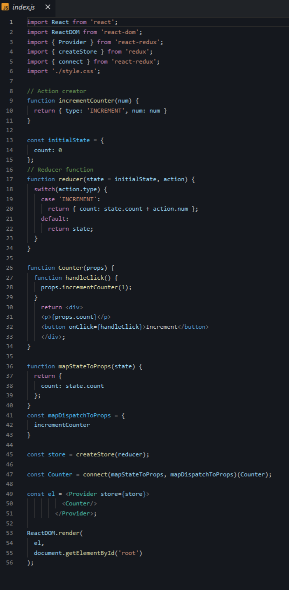
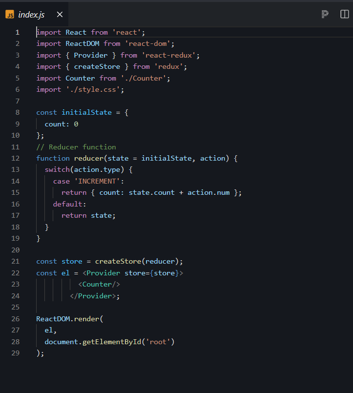
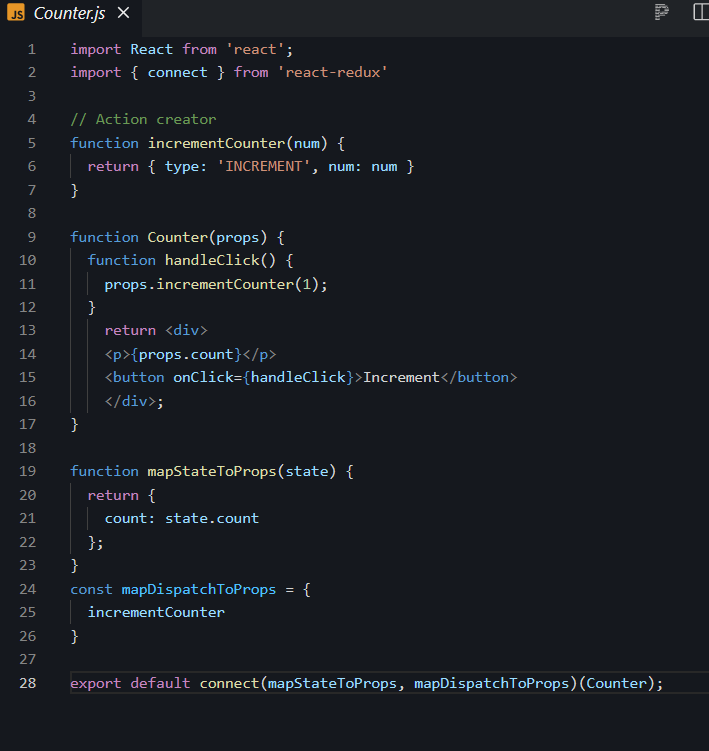

== 2. REDUX
Redux was created to make state management predictable, providing a single state container and strict rules
on how state can be changed.

Redux is a small JavaScript library and can be used with any front-end framework, such as React, Angular, jQuery.

It employs the "single source of truth" pattern.
In short, single source of truth just refers to relocating the application state and all associated logic o
utside of the application, allowing ANY component to access the data it needs.

NOTE: Having a single state container makes it easier to manage the state of your application,
as you can access and change the data from any component that needs it, without having to pass down the data.

=== 2.1 Store

In Redux, *the application's state is stored as a simple object, called store*.
There should only be a single store in an app.

For example, a store can look like this:

 {
  contacts: [{
    name: 'David'
  }, {
    name: 'Amy'
  }],
  toggle: true
}

NOTE: You cannot change the state directly. Instead, you need to dispatch an action.
Tap Continue to learn more!

=== 2.2 Actions and Reducers

==== 2.2.1 Actions

*An action* is just a *plain JavaScript object*:
Action can be viewed as payloads of information that send data to the store.
Actions are represented by simple JavaScript object and *need* to have a *type property:*

 {
  type: 'ADD_CONTACT',
  name: 'James'
 }

In the example above, we define an action with the type ADD_CONTACT and provide it a name property as its payload.

An action clearly describes why the state change happened, and can be dispatched from anywhere in your app.

NOTE: Notice that for the type we're using all uppercase letters and words separated by underscores.
This is also called "snake case". This is the generally accepted way to create an action type.

You can use any naming and structure for the other properties defining the data in the action.

You can, for instance, call it payload, and provide it an object with the data:

 {
    type: 'ADD_CONTACT',
    payload: {
        name: "Jimmy Barnes"
    }
 }

You should pass as little data in each action as possible. That keeps the actions clean and easy to read.

===== 2.2.1.1 Action Creators

In order to use the same action with different payloads, as well as create reusable code, we can create Action creators.

*Action creators are simple functions that return actions.*

For example:
 function addContact(person) {
   return {
     type: 'ADD_CONTACT',
     payload: person
   }
 }

The action creator function takes a person parameter and uses that as the actions payload.

Now, we can use the action creator to create multiple new contacts by passing it the corresponding data.

NOTE: Action creators are not built into the Redux library by default.
It is a pattern that was implemented to create code that reflects a more DRY (Don't Repeat Yourself) approach.

==== 2.2.2. Reducer Function

*To tie the store and the action together, we need to write a function, called a reducer.*
Reducers are functions that handle the actions.

The function takes the current state and the action as its parameters and returns the new state.
It has to be a pure function, meaning it cannot modify the current state. It has to return a new state object instead.

A reducer can handle multiple actions, so usually it includes a switch statement for each action case.

For example:

 function contactsApp(state, action) {
   switch (action.type) {
     case 'ADD_CONTACT':
       return [ ...state,  action.person ]
     default:
       return state
   }
 }

In the code above, our reducer function uses a switch statement to handle the appropriate actions.
As the default case, it just returns the current state. (is added for handling unknown actions)

These concepts are basically the idea of Redux: you hold the global state in a store,
define actions to describe what to change in the store and write reducer functions to handle those actions.

===== 2.2.2.1 Multiple Reducers

If you have more than one entity (i.e. users, products, invoices, orders, etc.), it's typically a good idea
to break them into multiple reducer functions to separate concerns.

Redux gives us a *method* that we can use called **combineReducers. **
This allows us to use more than one reducer so that when an action gets dispatched,
the action would get run through all of the reducers instead of only one.
It also allows us to separate the concerns of our store state.

For example:

 const contactsApp = combineReducers({
  addContacts,
  doSomething
 })

Now, our contactsApp is combining two reducers into one.

NOTE: It's a good practice to provide each reducer only the part of the state that it needs to manage.
This is called reducer composition, and is a fundamental pattern of building Redux apps.

=== 2.3 Core Concepts

Redux can be described using the following principles:

*Single source of truth*
The global state of the app is stored in a single *store*.

*State is read-only*
You can change the state only by dispatching *actions*. Action are objects, that contain information about what should be changed.

*Pure reducers*
Reducers are functions that handle the actions and return the next state of the application.
Reducers need to be pure, meaning they cannot modify the state, they need to return a new state object.

== 3 Redux with React

To build React app that use Redux, we first need to install Redux:

 npm install redux

This will install the Redux library.
However, Redux itself is just a small library, that can be used with different technologies.

To use it with React, we need to install another library, called react-redux:

 npm install react-redux

The react-redux library binds React with Redux, allowing React components to read data from a Redux store,
and dispatch actions to the store to update data.

=== 3.1 Example: counter App

* First, we need to create our action and corresponding reducer.

 function incrementCounter(num) {
   return {
    type: 'INCREMENT',
    num: num
   }
 }

The code above declares an action creator function named incrementCounter(),
which returns an action with type INCREMENT and the corresponding payload.

The reducer:

 const initialState = {
   count: 0
 };

 function reducer(state = initialState, action) {
   switch(action.type) {
     case 'INCREMENT':
       return { count: state.count + action.num };
     default:
       return state;
   }
 }

The code above defines a reducer function, which returns the new state based on the given action.
We increment the count state variable by the provided num value.

We also provide a default value for our state using the initialState variable.

* Creating the Store

To create the store, we call the createStore() function, which takes the reducer as its parameter:

 const store = createStore(reducer);

But how do we pass the store to our components?
That is achieved using a special <Provider> element. It makes the store available to any nested child component.

So, for our counter, we would have the following:

 const el = <Provider store={store}>
 <Counter/>
  </Provider>;

Provider takes the store as an attribute and makes it available to its child component.

We need to import { createStore } and { Provider } using the following syntax:
import { Provider } from 'react-redux';
import { createStore } from 'redux';

* Connecting to the Store

At this point, we have created our action, the reducer, the store,
and made it available to our Counter component using the Provider element.

In order to connect our component to the store, we need to call the connect() function.
The connect() function returns a new component, that wraps the component you passed to it and connects it to the store using its special parameter functions.

 function connect(mapStateToProps?, mapDispatchToProps?)

connect() takes two optional parameters:

*mapStateToProps*
This function is called every time the store state changes.
It receives the state as a parameter and returns the state for the component.
For example, for our Counter, we need to return the count state variable:

 function mapStateToProps(state) {
   return {
     count: state.count
   };
 }

Now, our component can access the count variable using its props!
Just as the name of the function states, it maps the state to the props.

*mapDispatchToProps*

As you may have guessed from the name, this parameter is used to map the dispatch functions to props.
It can be a simple object, defining the function that needs to be mapped:

 const mapDispatchToProps = {
  incrementCounter
 }

This might seem a bit confusing, but its very straightforward: mapStateToProps simply returns the state variables
as props to our component, while mapDispatchToProps allows to define how we dispatch actions and make
the dispatching functions available as props.

Both are optional, as, for example, your component might only need to read from the store.

NOTE:  we need to import the connect function: import { connect } from 'react-redux';

* Accessing The Store

Inside our component we just access the store properties using props

 function Counter(props) {
   function handleClick() {
     props.incrementCounter(1);
   }
     return 

      
{props.count}

      <button onClick={handleClick}>Increment</button>
     
;
 }

Notice, that we pass 1 as the argument to our incrementCounter(), making our counter increment by 1.
We can change the value to any other number, and our counter will behave as expected,
because we handled the increment parameter in our reducer.

Now, the only thing left is to call the connect() function for our Counter component and render it on the page:

 const Counter = connect(mapStateToProps, mapDispatchToProps)(Counter);

 const el = <Provider store={store}>
          <Counter/>
        </Provider>;

Remember, connect() returns a new component, which wraps the component it received.

complete code:

* Project Structure

In our Counter example, we wrote the whole code in a single source file.
Usually, web apps contain multiple component, reducers and actions.

To make our project more manageable, we can use separate source files (and folders) for components, reducers and actions.
For example, we can move our Counter component and the action creator function to a separate Counter.js file.

In order to use the Counter component in our index.js, we need to export it first:

 export default connect(mapStateToProps, mapDispatchToProps)(Counter);

Notice, we export the connected component.

Now, we can import the component in index.js:

 import Counter from './Counter';

