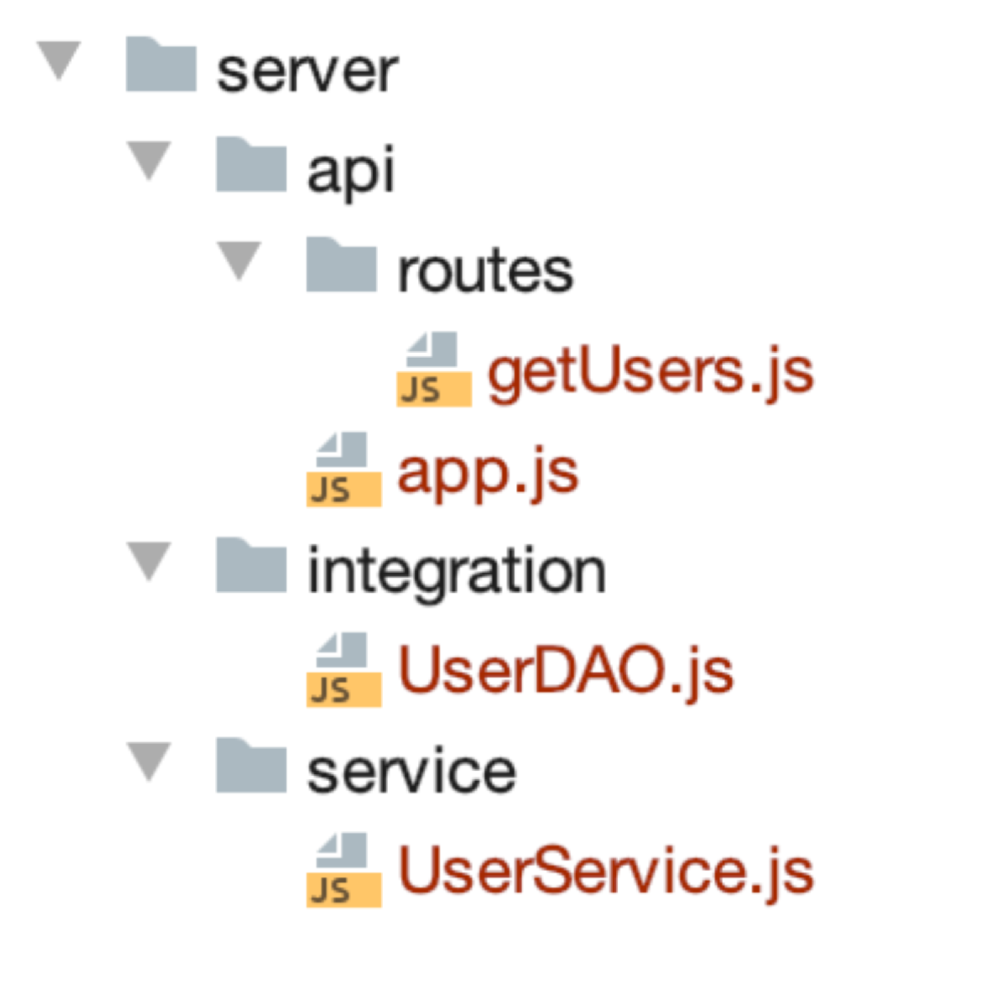

== RESTful web API design

Most modern web applications expose APIs that clients can use to interact with the application.
A well-designed web API should aim to support:

    * *Platform independence*.
    Any client should be able to call the API, regardless of how the API is implemented internally.
    This requires using standard protocols, and having a mechanism whereby the client and the web service can agree
    on the format of the data to exchange.

    * *Service evolution*.
    The web API should be able to evolve and add functionality independently from client applications.
    As the API evolves, existing client applications should continue to function without modification.
    All functionality should be discoverable so that client applications can fully use it.

=== What is REST?
https://docs.microsoft.com/en-us/azure/architecture/best-practices/api-design

In 2000, Roy Fielding proposed Representational State Transfer (REST) as an architectural approach to designing web services.
REST is an architectural style for building distributed systems based on hypermedia.
REST is independent of any underlying protocol and is not necessarily tied to HTTP.
However, most common REST API implementations use HTTP as the application protocol.

A primary advantage of REST over HTTP is that it uses open standards, and does not bind
the implementation of the API or the client applications to any specific implementation.
For example, a REST web service could be written in ASP.NET, and client applications can use any language
or toolset that can generate HTTP requests and parse HTTP responses.

=== design principles of RESTful APIs using HTTP:

 * REST APIs are designed around resources, which are any kind of object, data, or service that can be accessed by the client.

 * *A resource has an identifier, which is a URI* that uniquely identifies that resource.

For example, the URI for a particular customer order might be:

 https://adventure-works.com/orders/1

 * Clients interact with a service by exchanging representations of resources.
   Many web APIs use JSON as the exchange format.
   For example, a GET request to the URI listed above might return this response body:

 {"orderId":1,"orderValue":99.90,"productId":1,"quantity":1}

 * REST APIs use a uniform interface, which helps to decouple the client and service implementations.
For REST APIs built on HTTP, the uniform interface includes using standard HTTP verbs to perform operations on resources.
The most common operations are GET, POST, PUT, PATCH, and DELETE.

 * REST APIs use a stateless request model. HTTP requests should be independent and may occur in any order,
so keeping transient state information between requests is not feasible.
The only place where information is stored is in the resources themselves, and each request should be an atomic operation.
This constraint enables web services to be highly scalable, because there is no need to retain any affinity between
clients and specific servers. Any server can handle any request from any client.
That said, other factors can limit scalability. For example, many web services write to a backend data store,
which may be hard to scale out.

 * REST APIs are driven by hypermedia links that are contained in the representation.
For example, the following shows a JSON representation of an order.
It contains links to get or update the customer associated with the order.

 {
 "orderID":3,
 "productID":2,
 "quantity":4,
 "orderValue":16.60,
 "links": [
 {"rel":"product","href":"https://adventure-works.com/customers/3", "action":"GET" },
 {"rel":"product","href":"https://adventure-works.com/customers/3", "action":"PUT" }
 ]
 }

* In 2008, Leonard Richardson proposed the following maturity model for web APIs:

** Level 0: Define one URI, and all operations are POST requests to this URI.
** Level 1: Create separate URIs for individual resources.
** Level 2: Use HTTP methods to define operations on resources.
** Level 3: Use hypermedia (HATEOAS, described below).

Level 3 corresponds to a truly RESTful API according to Fielding's definition.
In practice, many published web APIs fall somewhere around level 2.

* Organize the API design around resources

Focus on the business entities that the web API exposes.
For example, in an e-commerce system, the primary entities might be customers and orders.
Creating an order can be achieved by sending an HTTP POST request that contains the order information.
The HTTP response indicates whether the order was placed successfully or not.
When possible, resource URIs should be based on nouns (the resource) and not verbs
(the operations on the resource).

 https://adventure-works.com/orders // Good

 https://adventure-works.com/create-order // Avoid

* A resource doesn't have to be based on a single physical data item. void creating APIs that simply mirror
the internal structure of a database. The purpose of REST is to model entities and the operations
that an application can perform on those entities. A client should not be exposed to the internal implementation.

*use plural nouns for URIs that reference collections.*

*organize URIs for collections and items into a hierarchy*.

For example, /customers is the path to the customers collection, and /customers/5 is the path to the customer with ID equal to 5.
This approach helps to keep the web API intuitive.
Also, many web API frameworks can route requests based on parameterized URI paths,
so you could define a route for the path /customers/{id}.

* Also *consider the relationships between different types of resources* and how you might expose these associations.
Provide navigable links to associated resources in the body of the HTTP response message.

* Another factor is that *all web requests impose a load on the web server*. The more requests, the bigger the load.
Therefore, try to *avoid "chatty" web APIs that expose a large number of small resources.*

* Avoid introducing dependencies between the web API and the underlying data sources

=== Define API operations in terms of HTTP methods
The HTTP protocol defines a number of methods that assign semantic meaning to a request.
The common HTTP methods used by most RESTful web APIs are:

 * GET retrieves a representation of the resource at the specified URI.
The body of the response message contains the details of the requested resource.
 * POST : a post request *creates a resource*. The server assigns a URI for the new resource, and returns that URI to the client.
In the REST model, you frequently apply POST requests to collections.
The new resource is added to the collection. A POST request can also be used to submit data for processing
to an existing resource, without any new resource being created.
Note that POST can also be used to trigger operations that don't actually create resources.
 * PUT: A PUT request *creates a resource or updates an existing resource*.
The client specifies the URI for the resource. The request body contains a complete representation of the resource.
If a resource with this URI already exists, it is replaced. Otherwise a new resource is created, if the server supports doing so.
PUT requests are most frequently applied to resources that are individual items, such as a specific customer,
rather than collections. A server might support updates but not creation via PUT.
Whether to support creation via PUT depends on whether the client can meaningfully assign a URI to a resource before it exists.
If not, then use POST to create resources and PUT or PATCH to update.
The body of the request message specifies the resource to be created or updated.
 * PATCH:  a patch request *performs a partial update to an existing resource*.
The client specifies the URI for the resource. The request body specifies a set of changes to apply to the resource.
This can be more efficient than using PUT, because *the client only sends the changes, not the entire representation of the resource*.
Technically PATCH can also create a new resource (by specifying a set of updates to a "null" resource), if the server supports this.
 * DELETE removes the resource at the specified URI.

== PROJECT STRUCTURE (server)

What would be a good project structure for a Node.js application?

https://bytearcher.com/articles/node-project-structure/

Small applications don't matter that much, but for larger apps with more complex logic, it's worth thinking
about the project structure.

One way to organize a project is to use three-layer architecture.

=== Three-layer architecture

The project is structured into three layers: API, Service and Integration layers.

Each layer has a specific set of responsibilities that are clearly defined and easy to grasp.
Each layer accesses the layer below it, never above it.
Serving a request touches each layer starting from the top, traveling all the way down,
and then resurfacing back to the topmost layer.

=== API layer

The API Layer is responsible for receiving the HTTP request and parsing the payload from it.
This layer would then forward the payload removed of any HTTP-specific items to the following Service layer.

Express.js lives only on this level. You'd have your main app.js that set up the server and individual route files.
Route files define validations and call service layers, leaving all req and res objects behind.

=== Service layer

The Service Layer is responsible for performing business logic, i.e. making things happen.
It's agnostic of any HTTP specific constructs, and the caller could as well as be a command-line application,
a timer job or a test suite. Input is plain vanilla JavaScript objects instead of JSON.

Services perform business logic. They validate inputs against business rules and call other services in the Service layer.
If they need to talk to outside systems, they use the Integration layer to do that.

=== Integration layer

The code in the Integration Layer is responsible for performing I/O outside the process boundaries.
It talks to databases and makes HTTP requests to 3rd party web APIs.

Most of the contents in this layer would be higher abstraction clients.
For example, a client handling the communication to a web API would accept vanilla objects as arguments
and would hide the complexity of formulating an HTTP request payload and making the call.

=== Clear responsibilities

This division achieves separation of concerns. Each layer has a specific responsibility,
and it translates well into a directory structure.

image::images/image-2022-08-19-12-29-29-264.png[width=600]

You could translate this architecture into a project structure by having a separate directory for each layer.

